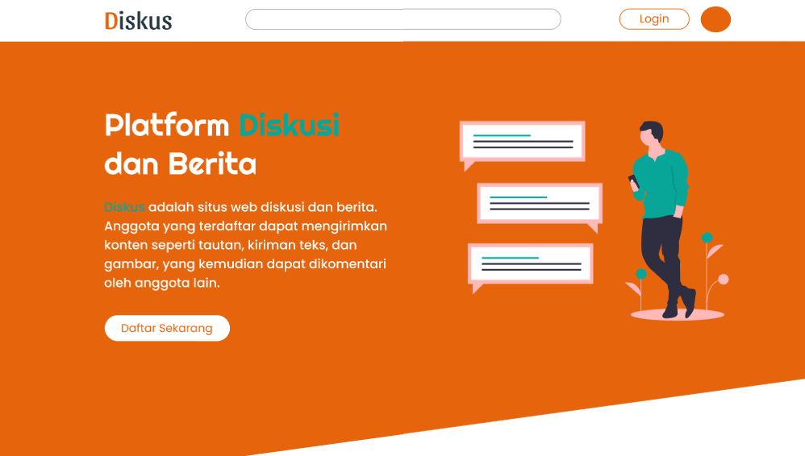
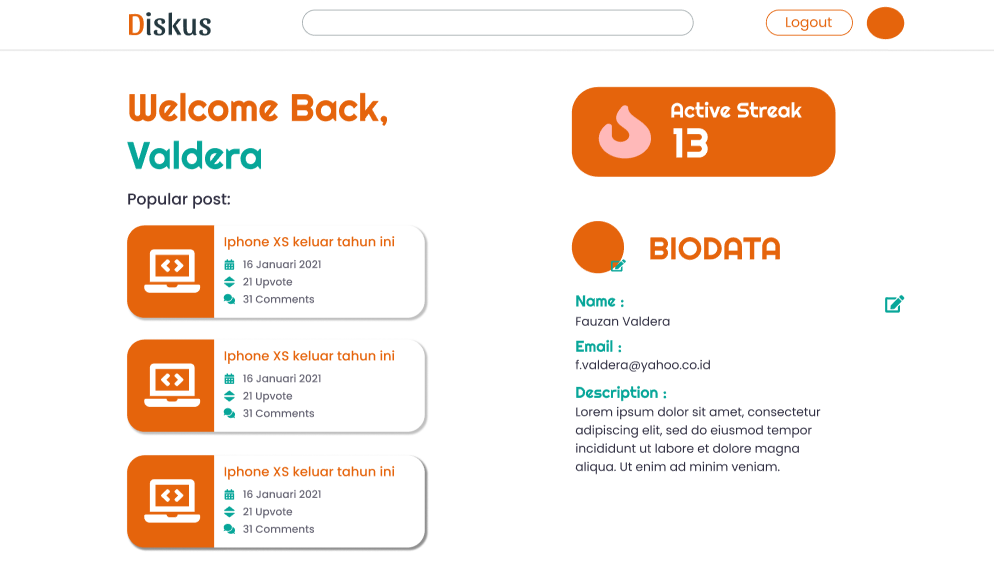
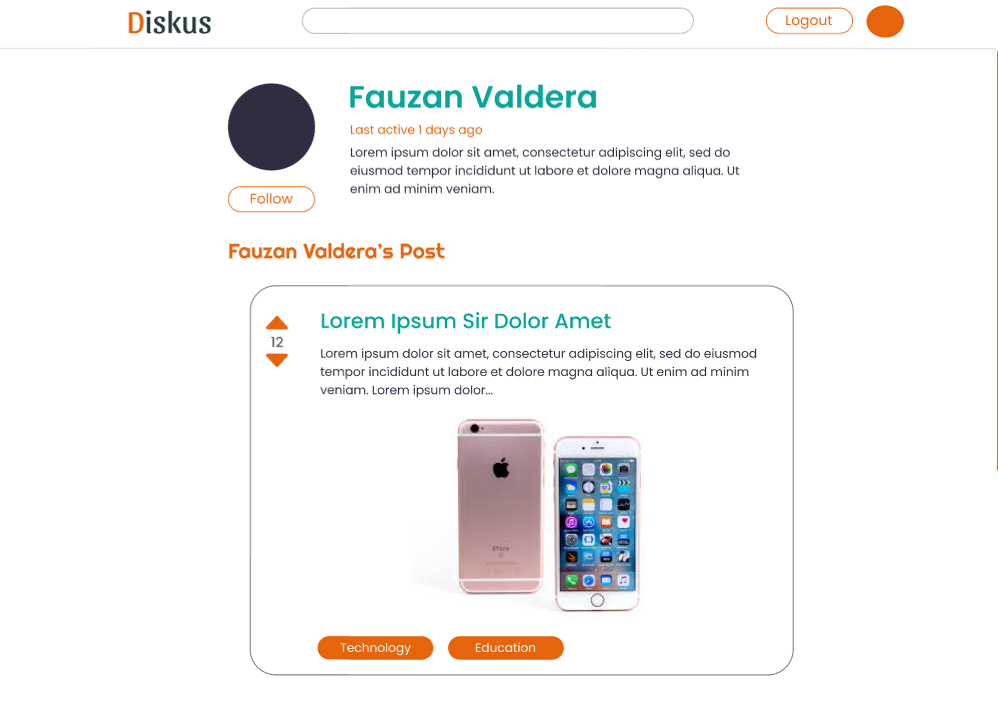

# Diskus Web App

Diskus adalah situs web diskusi dan berita. Anggota yang terdaftar dapat mengirimkan konten seperti tautan, kiriman teks, dan gambar, yang kemudian dapat dikomentari oleh anggota lain.

## Getting Started

- Download this project (by click code and click download as a zip)
- Open the terminal
- 'npm install' to install the package

## Built With

- [MongoDB](https://www.mongodb.com)
- [Express.js](https://expressjs.com/)
- [React.js](https://reactjs.org/)
- [Node.js](https://nodejs.org/en/)

## Authors

- **Fauzan Valdera** - _Full Stack_ - [Valdera](https://github.com/Valdera)
- **Helkia Yeremia** - _Back End_ - [Helkia Yeremia](https://github.com/helkiayeremia)
